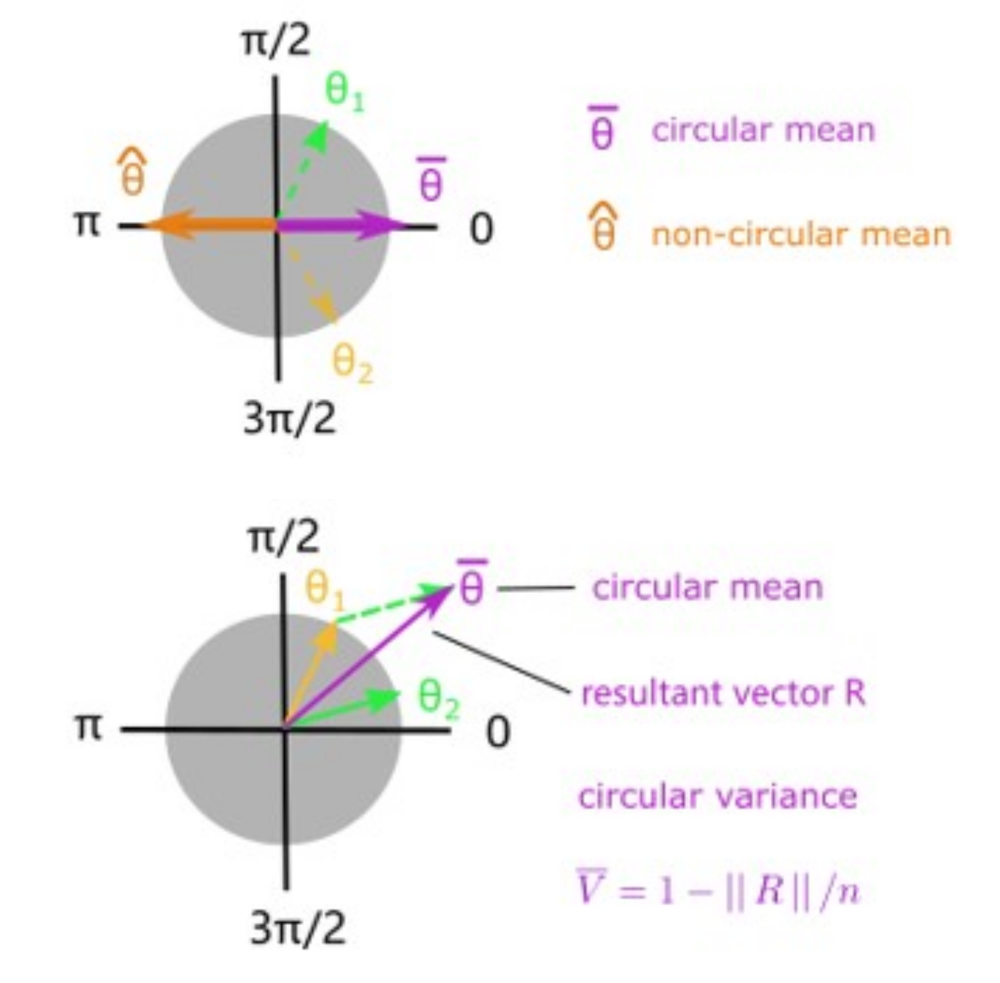
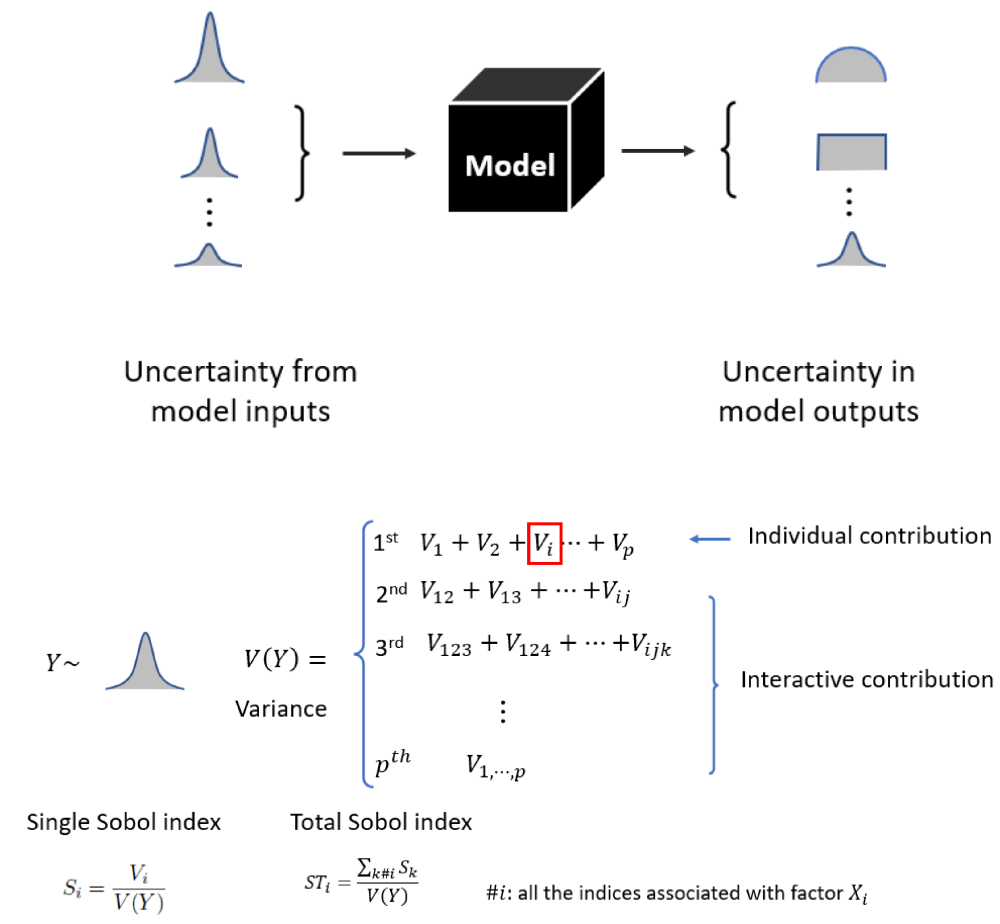
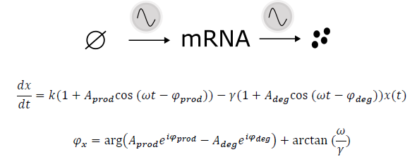
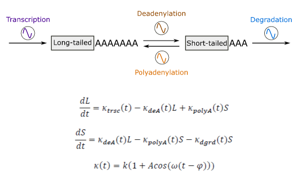

# CircularSobol

CircularSobol is a computational tool that calculates the circular Sobol indices 
tailored for oscillation models.

## Circular statistics Vs Non-circular statistics

Angles by their nature have no maximum nor minimum values, therefore circular mean 
and circular variance are differently defined from their counterpart in 
non-circular statistics.

## Sobol indices

Sobol's method or Sobol indices, is a global sensitivity analysis based on the decomposition of variance 
(orginal paper: I. M. Sobol′, 2001).

## Circular Sobol indices for oscillation models

CircularSobol combines the parameter sampling scheme from the Monte Carlo estimate algorithms
in the original Sobol's method and the definition of circular variance to more
accurately quantify the contribution of individual parameters to the variance in circular model
output.

### Toy models with periodic outputs
First, try CircularSobol with dummy toy models involving periodic output quantities
generated by transformation of simple linear models. 
<pre><code>
% MATLAB code (try run Toy_Model_Run.m in MATLAB yourself)
% Example of calculating Sobol indices for toy models 

% 1st step: build a model using bbModel class

% check ToyModel_1.m
% ToyModel_1 
%     input -> double array of angles, x = [x1 x2 x3]
%     output -> double array of angles, y = [y1 y2]

% class bbModel 
%    input -> Function Handle
%          -> scalar, number of inputs
%          -> scalar, number of outputs
%          -> optional name-value pair, 'OutputType', boolean array
%             1:Circular, 0: non-Circular, default:[0...0], of length equal to # of outputs
%             e.g. ToyModel_1 has 2 outputs, y1 and y2, then 'OutputType' should be set as [1 1]
                                       
toy_model_1 = bbModel(@ToyModel_1,3,2,'OutputType',[1 1]);

% 2nd step: define the parameter space of your model
% Use MATLAB built-in 'makedist' function or your own datasets

uni_pd = makedist('Uniform','lower',0,'upper',2*pi);
params_1 = repmat({uni_pd},3,1); % Toy Model 1-3

% 3rd step call the CircularSobol estimator of Sobol indices

% call CircularSobol (check argument syntax in CircularSobol.m)
tic
disp('Start running of toy models');
% use Circular Sobol indices method
% try use different formula, SampleSize, GroupNumber, GroupSize

[S1, ST] = CircularSobol(toy_model_1, params_1,'method','Circular','SampleSize',10^5,'formula',1,...
                                                            'GroupNumber',10^3,'GroupSize',10^3);
toc

</code></pre>

### Rhythmic mRNA expression model
Besides rhythmic transcription, mounting evidence has suggested the role of rhythmic post-transcriptional regulation
in shaping and fine-tuning the rhythmicity of mature mRNA abundance. Sarah Luck et al. 2012
developed a simple mathematical model of rhythmic mRNA expression to show that rhythmic degradation can explain 
the observed discrepancy between rhythmic mRNAs and proteins. The model and analytic approximation of the peak
phase of rhythmic mRNA $\Phi_{x}$ are shown here.

### Rhythmic mRNA poly(A) tail length model
Most eukaryotic mRNAs carry a tract of adenosines, known as the poly(A)  tail, whose function has been assoicated with
mRNA stability and translation efficiency. It is interesting that hundreds of mRNAs in mouse liver are observed to show
rhythmic poly(A) tail length (approximated by the ratio of long-tailed/short-tailed mRNA, i.e. L/S).
We developed a simple model accounting for the 4 coupled rhythmic regulation processes of mRNA poly(A) tail, whose mathematical descirption are shown here.

