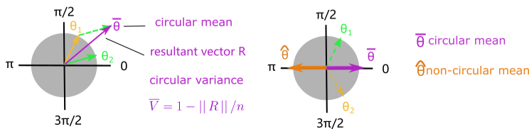

# CircularSobol

CircularSobol is a computational tool that calculates the circular Sobol indices 
tailored for biological oscillation models.

## Circular statistics Vs Non-circular statistics

Angles by their nature have no maximum nor minimum values, therefore circular mean 
and circular variance are differently defined from their counterpart in 
non-circular statistics.

## Sobol indices

Sobol's method or Sobol indices, is a global sensitivity analysis based on the decomposition of variance 
(orginal paper: I. M. Sobol′, 2001).

## Circular Sobol indices for biological oscillation models

CircularSobol combines the parameter sampling scheme from the Monte Carlo estimate algorithms
in the original Sobol's method and the definition of circular variance to more
accurately quantify the contribution of individual parameters to the variance in circular model
output.
